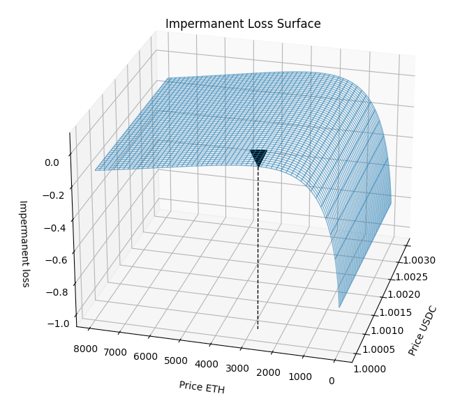

# Charting Surfaces

- [x] Chart Impermanent Loss 

## Running 
```
python3 -m venv .venv
source .venv/bin/activate 

pip install -r requirements.txt

python il-surface.py
```



## Acknowledgment
- [https://github.com/gauss314/defi/](blob/826ec4158aead5c85e05340fda9a372e5c110394/defi/defi_tools.py#L390)

